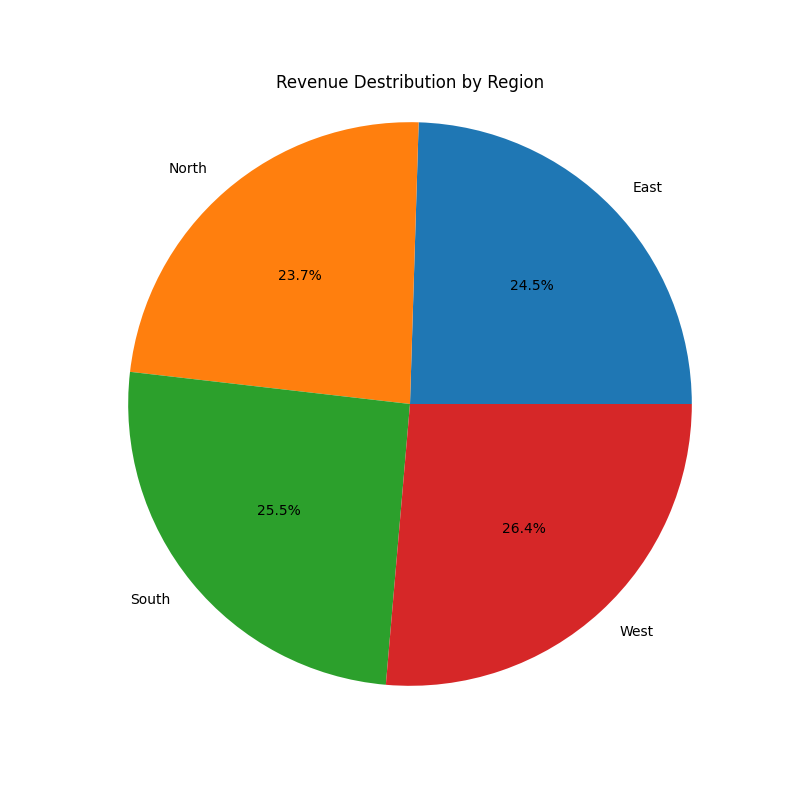

# 🎨 Art and Craft Supplies Analysis



Welcome to the **Art and Craft Supplies Analysis** repository!  
This project aims to analyze various art and craft supplies — their features, pricing, and customer preferences — to help users make informed purchasing decisions.

---

## 📚 Table of Contents
- [Project Overview](#project-overview)
- [Features](#features)
- [Installation](#installation)
- [Usage](#usage)
- [Contributing](#contributing)
- [License](#license)
- [Contact](#contact)

---

## 🧩 Project Overview
This repository contains a collection of data, tools, and scripts designed to analyze art and craft supplies.  
The analysis includes comparing brands, types of supplies (paints, brushes, papers, etc.), and user reviews to identify trends and preferences.

The project provides insights into:
- Popular and high-rated art supplies.
- Pricing differences among brands.
- Visual comparisons and regional data trends.

---

## 🚀 Features
- 📦 **Data Collection** — Aggregated data on various art and craft supplies.  
- 🧮 **Analysis Tools** — Python scripts for data analysis and visualization.  
- 🏷️ **Brand Comparison** — Compare brands based on features and customer reviews.  
- 💰 **Price Comparison** — Compare prices across multiple online stores.  
- 📊 **Visualization** — Interactive and static graphs for better insights.

---

## ⚙️ Installation
To get started with this project, clone the repository and install the required dependencies:

```bash
git clone https://github.com/nazrulislam1835/Art-and-Craft-Supplies-Analysis.git
cd Art-and-Craft-Supplies-Analysis
pip install -r requirements.txt

---

🤝 Contributing

We welcome contributions to improve the analysis or add new features!
To contribute:
1. Fork this repository
2. Create a new branch
3. Make your changes
4. Submit a pull request
Please make sure to follow the code of conduct and write tests for new features.
